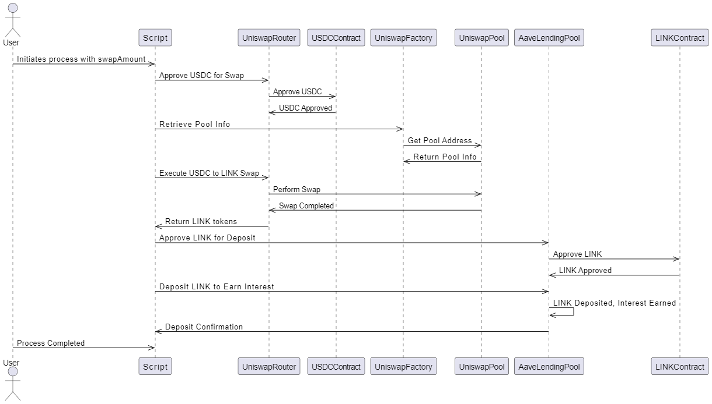

# DeFi Script: Uniswap Swap & Aave Deposit

## Overview of Script

This script demonstrates a decentralized finance (DeFi) workflow by integrating two prominent DeFi protocols: Uniswap and Aave. The primary purpose of the script is to swap USDC for LINK using Uniswap, and then deposit the obtained LINK into Aave's lending pool to earn interest.

### Summary

1. **Token Swap on Uniswap**:
   - The script begins by swapping a specified amount of USDC for LINK on Uniswap V3.
   - The process involves approving the USDC for swap, retrieving the necessary pool information, preparing the swap parameters, and finally executing the swap on Uniswap.

2. **Deposit LINK into Aave**:
   - After the swap, the script approves the LINK tokens for deposit in Aave.
   - The approved LINK is then deposited into Aave's lending pool, where it begins earning interest.

### Key Steps:
- **Approve USDC**: The script first approves the USDC tokens to be used by Uniswap's Swap Router.
- **Retrieve Pool Info**: Retrieves the necessary information about the liquidity pool from Uniswap.
- **Execute Swap**: Executes the swap of USDC to LINK on Uniswap.
- **Approve LINK**: Approves the LINK tokens for deposit in Aave.
- **Deposit LINK**: Deposits the LINK tokens into Aave's lending pool.

## Diagram Illustration

The diagram below illustrates the sequence of steps and interactions between the DeFi protocols (Uniswap and Aave):

